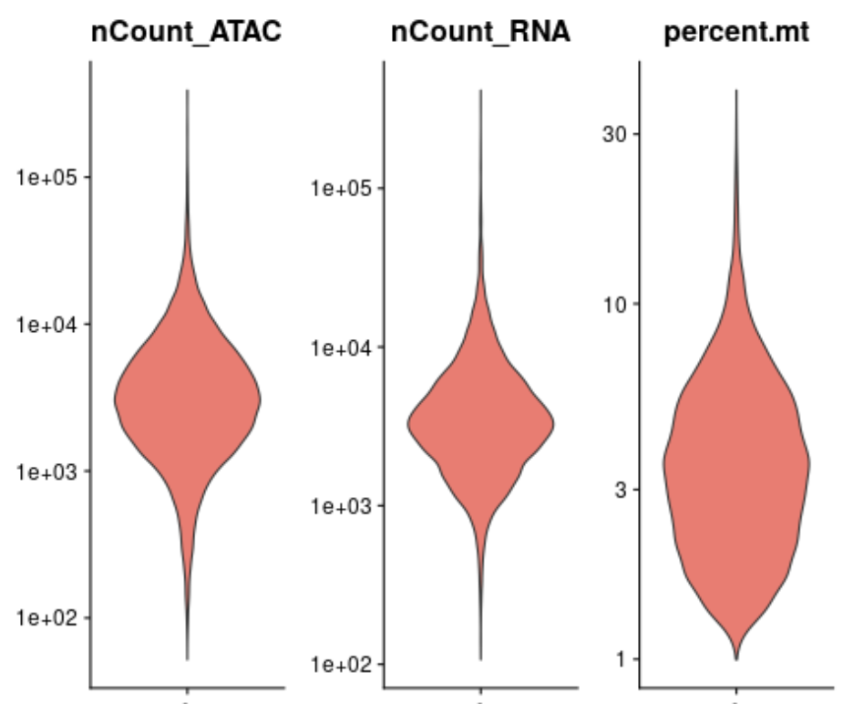
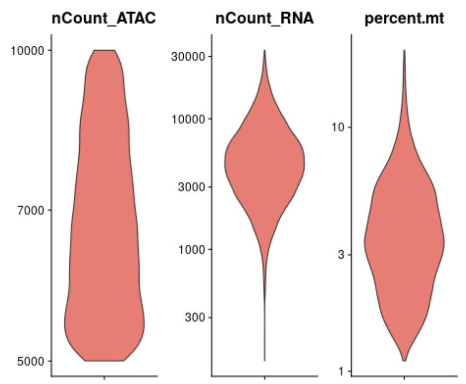
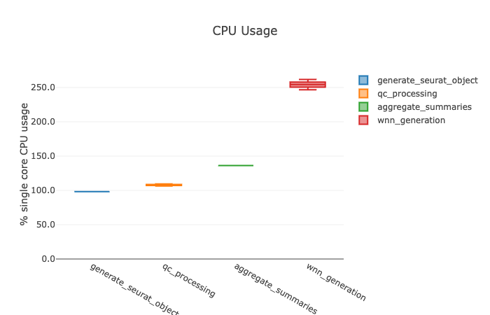
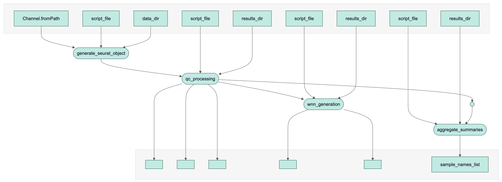
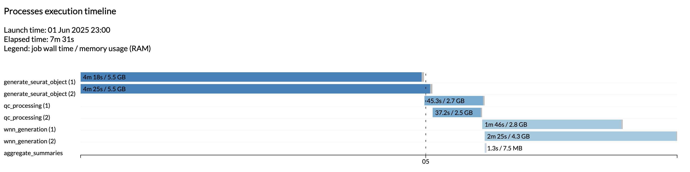
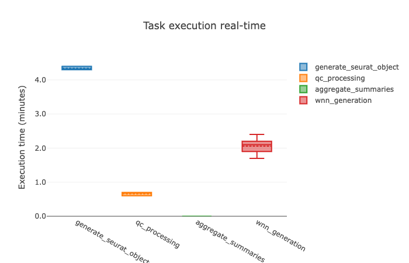
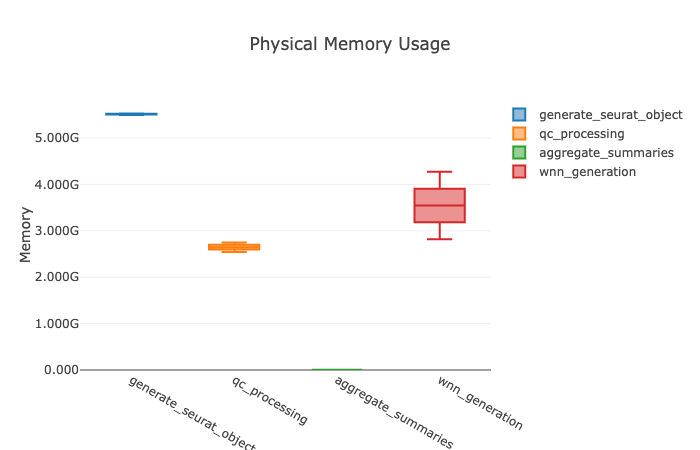
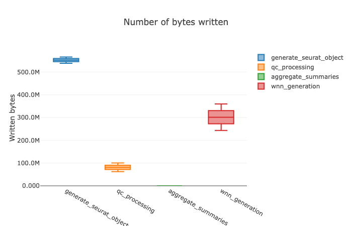

# Quick Setup and Run Locally


This early workflow uses docker on a local machine. Be sure to have docker installed and build the image prior to running the workflow.
```
docker build -t seurat_qc -f Dockerfile.signac 
```

Place your samples from Cell Ranger (directories) in `data/` and then run
```
nextflow run main.nf
```


# Current state of the project:
Streamlined analysis:
- Creates seurat object per sample
- Conducts seurat QC on each object
- Generates ATAC, RNA, and WNN-Based UMAPS per sample
- Collects summary information from all samples (currently QC information for now)

2 Samples run in approximately 7.5 minutes (up to 12 minutes before)

Error Strategies:
- Retries main pipeline steps
- Ignores failure for collective summary generation, which allows

Additional notes:
- Longest step is Seurat Object Generation
- Most resource intensive step is WNN Generation (I believe this is due to the TFDIF step)
- Each sample generates approximately 700MB to 1GB of data. Focus on reducing this later if necessary

# Example of Data Generated from Mouse Lymphoma Samples
Some plots are cropped to remove sample names

### UMAPs

Will be editing attributes of the plots for better visualization


### Pre-QC Violinplots


### Post-QC Violinplots



# Report Data Below







