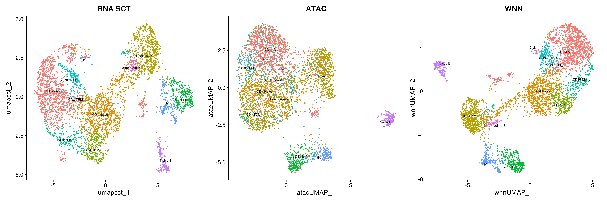
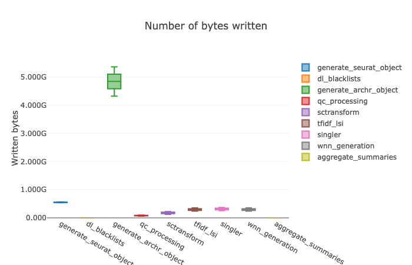

# Quick Setup and Run Locally


This early workflow uses docker on a local machine. Be sure to have docker installed and build the image prior to running the workflow.

WARNING - Building the container may take several hours
```
# Build the container from the Docker directory
docker build -t seurat_qc .
```

Place your post-Cell Ranger ARC processed samples in `data/` and then run. Ensure each sample folder is name the sample, and ensure there is an `outs` directory within the sample name folder which holds the necessary count matrices. Currently the pipeline supports reading the `.h5` files and will later add other fallback options.
```
nextflow run main.nf
```


# Current state of the project:
Streamlined analysis:
- Per Sample:
    - Creates seurat object
    - Creates ArchR object
    - Filters seurat QC on seurat object
    - Performs SCTransform on Gene Expression (GEX) matrices
        - ElbowPlot
        - UMAP for visualizing clusters
        - Differential gene expression analysis heatmap between clusters
    - Performs TFIDF and LSI on ATAC Peak matrices
        - Volcano plot
        - Depth Corr plot
        - UMAP for visualizing clusters
    - Performs SingleR annotation
        - Supports MM10 reference data for now
    - Performs Weighted Nearest Neighbors on Peak matrices and GEX matrices
        - Generates combined ATAC, RNA, and WNN-Based UMAP plots per sample
- For all samples:
    - Collects summary information from all samples (currently QC information for now)

Error Strategies:
- Retries main pipeline steps
- Ignores failure for collective summary generation

Additional notes:
- Longest step is Seurat Object Generation
- Most CPU intensive step is TFIDF_LSI process
- Most Memory intensive step is generating the Seurat Object (this may be because of the amount of memory allocation)
- Most resource intensive step is WNN Generation (I believe this is due to the TFDIF step)
- Each sample generates approximately 3GB of data. Focus on reducing this later if necessary

### Fixes in progress
- SingleR annotation needs further research and tweaking
- Fix Volcano Plot for better visualizations
- Smoother inputs and outputs for scripts (currently building the minimum working product)
- Implement RPCA
- Remove unneeded UMAPs


# Example of Data Generated from Mouse Lymphoma Samples

### QC Filtering


### Normalization Metrics


### UMAPs - Will adjust the number of graphs and how its presented




### Differential Gene Expression and Differential Peak Analysis


# Pipeline Processing Results





